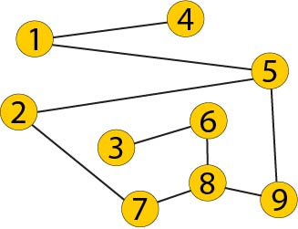
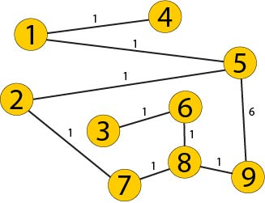

# Shortest Distance - Whiteboarding

Talk through this problem and whiteboard the solution with a partner.

## Description

Write an algorithm that finds the shortest distance between 2 nodes (identified by numbers), for example if you have the graph description below, the shortest distance between 1 and 8 is `1 > 5 > 9 > 8`.

```
var steps = [
    {from:1, to:4},
    {from:1, to:5},
    {from:2, to:5},
    {from:2, to:7},
    {from:3, to:6},
    {from:5, to:9},
    {from:6, to:8},
    {from:7, to:8},
    {from:8, to:9}
];
```



## Stretch

Taking edge weights into consideration, find the shortest path with the lowest weight. For example, even though the path `1 > 5 > 9 > 8 > 6 > 3` is shorter than `1 > 5 > 2 > 7 > 8 > 6 > 3`, the second path has a lower weight.


